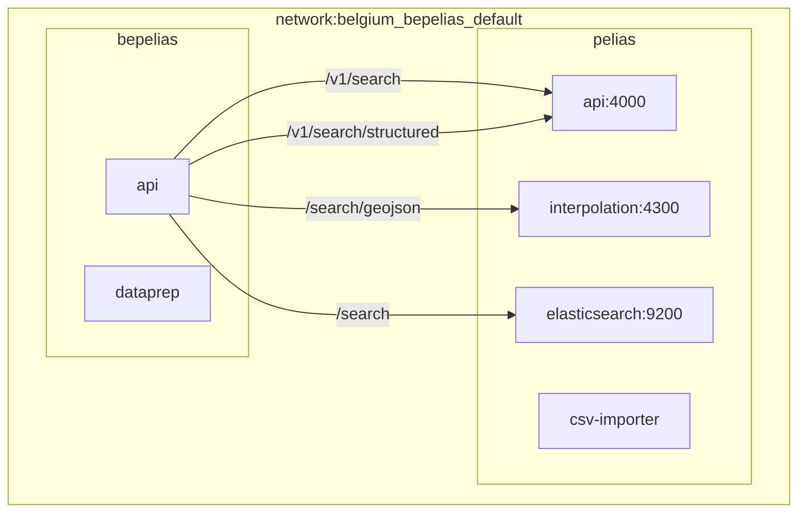
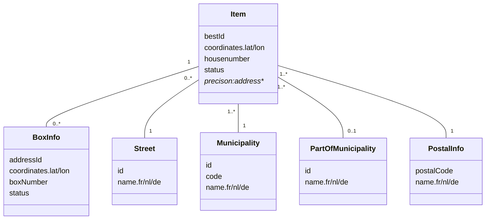
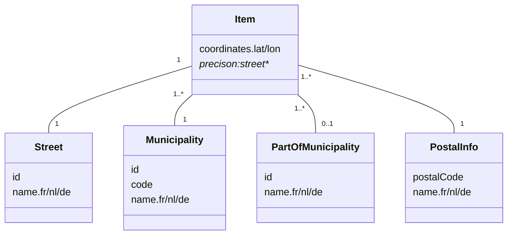
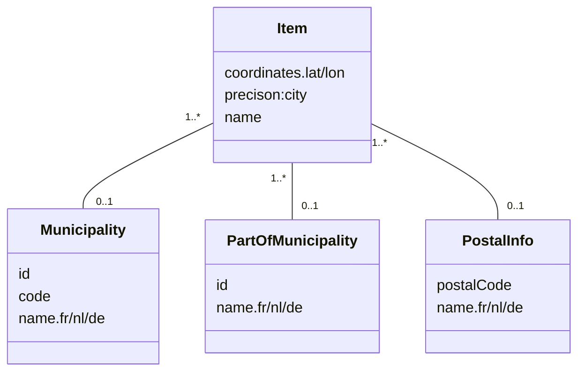
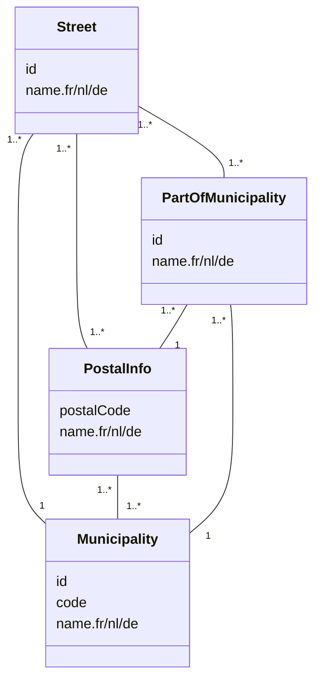
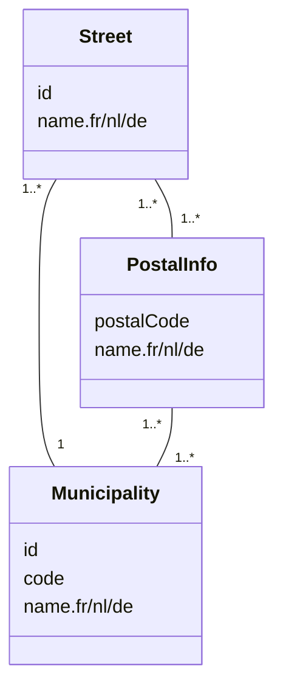
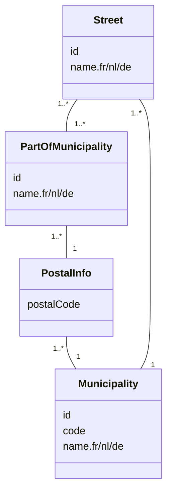
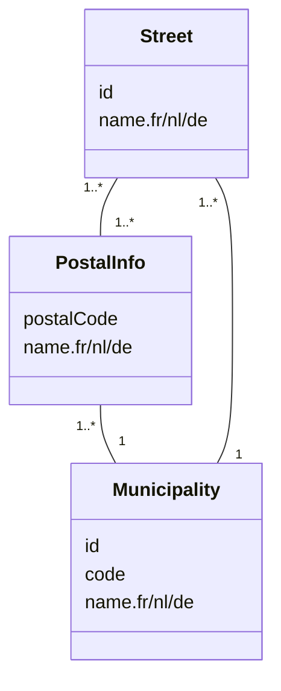

# Context

See more info in webinar "Geocoding" (in French, 28/09/2023): https://www.smalsresearch.be/webinar-geocoding-follow-up/

The current version of Pelias for BeSt Address (https://github.com/pelias/docker/tree/master/projects/belgium ; authentic source for addresses in Belgium) has two main problems:
- Data (trought openaddresses.io) are not updated anymore since mid-2021, as: 
    - Current format for BeSt Address csv file is not recognized by openaddresses, since Feb 2021 (column "EPSG:4326_lat" and similar contain mixed case)
    - OpenAddresses changed its dataflow from "https://results.openaddresses.io/" to "https://batch.openaddresses.io/", and since mid 2021, 
      "results" is no longer updated. But Pelias still uses this dataflow
- Geocoder is not very robust, but some simple changes allow matching to work.

The current projet aims at:
- Building a new dataflow, generating CSV compatible with Pelias, based on BestAddress CSV files
- Adding a "wrapper" above Pelias, trying different versions of an address as long as the address is not recognized.

# Disclaimer

This project is realized by Vandy Berten (Smals Research, https://www.smalsresearch.be/) for a PoC in collaboration with NGI (https://www.ngi.be), CNNC (https://centredecrise.be/fr) and Bosa (https://opendata.bosa.be/). This has not been (so far) approved by any of those partners. We do not offer any support for this project.


# Build

This project is composed of two parts: 
- Pelias, based on custom files. It is built upon an adaptation of https://github.com/pelias/docker/tree/master/projects/belgium, but based on CSV files we prepare. 
   This component is composed of +/- 6 docker containers (named pelias_xxxx)
- bePelias: REST API improving robustness of Pelias ("wrapper") + file preparator

Steps (short version): 

```
./scripts/build.sh                 # Build pelias & bepelias docker images (~30 minutes)
./scripts/feed.sh                  # Prepare files from Bosa and load them. Should also be run to update data (~1h30)
./scripts/run.sh                   # Run Pelias and bePelias API (with default parameters)
```

## More detailled steps

### Build

- `./scripts/build.sh api` : Build bePelias docker images (bepelias/api and bepelias/dataprep : ~5 min)
- `./scripts/build.sh pelias` : Build bePelias docker images (~25 min)
- `./scripts/build.sh cleanup` : Shut down everything, remove all docker images and all data


### Feed

- `./scripts/feed.sh <operation> <region>`, where:
    - `<operation>` in:
        - `prepare_csv`: Load data from Bosa website and prepare them to be Pelias ready. Save them in data/ folder
        - `update`: Move CSV files from "data" folder into appropriate Pelias folder and load them
        - `clean`: delete CSV files (useless after load) 
        - `all` (default): `prepare_csv + update + clean`
    - `<region>` in:
        - `bru`: Brussels
        - `wal`: Wallonia
        - `vlg`: Flanders
        - `all` (default): Belgium
- Examples:
    - `./scripts/feed.sh prepare_csv`: Prepare CSV (for all regions)
    - `./scripts/feed.sh update`: Load files (prepared par `prepare_csv`)
    - `./scripts/feed.sh all bru`: Prepare and update only Brussels data 
    - `./scripts/feed.sh prepare_csv bru`: Prepare only Brussels data 
    - `./scripts/feed.sh update bru`: Update only Brussels data

### Run

- Several parameters can be changed in docker-compose.yml, in "services>api>environment"
   - `PELIAS_HOST=172.27.0.64:4000`: IP+port of Pelias server
   - `LOG_LEVEL=LOW`: level of logs (`HIGH`, `MEDIUM` or `LOW`)
   - `NB_WORKERS=8`: number of (gunicorn) workers
- `./scripts/run.sh api`: start bePelias API (with the options described above)
- In order to overide options without updating docker-compose.yml: `docker-compose run --rm -d -e LOG_LEVEL=HIGH api`
- `./scripts/run.sh pelias`: start Pelias server 


### Two machines build

It is possible to split tasks onto two servers: 
- A "back" server: build images, prepare CSV. This server needs an Internet connection
- A "front" server (serving APIs): run images, load CSV. An Internet connection is not required.


- On both back and front servers: git clone or copy the whole bePelias repo
- On the back server: 
   - `./scripts/build.sh`
   - `./scripts/feed.sh prepare_csv` (or, for a shortest test; `./scripts/feed.sh prepare_csv bru`)
   - Save "pelias/*" and "bepelias/api" docker images:
      - `docker save bepelias/api | gzip > docker-images-bepelias-api.tar.gz`
      - `docker save  $(docker-compose  -f pelias/projects/belgium_bepelias/docker-compose.yml config | awk '{if ($1 == "image:") print $2;}' ORS=" ") | gzip > docker-images-pelias.tar.gz`
   - Archive "data/bestaddress*.csv" files:  `tar czf data.tar.gz data`
   - Archive "pelias" folder: `tar czf pelias.tar.gz pelias`
- Copy files (`docker-images-bepelias-api.tar.gz, docker-images-pelias.tar.gz, data.tar.gz,  bepelias.tar.gz`) into "bepelias" folder on front server
- On the front server: 
   - Load "pelias/*" and "bepelias/api" images: 
       - `gunzip -c docker-images-bepelias-api.tar.gz | docker load`
       - `gunzip -c docker-images-pelias.tar.gz | docker load `
   - Unarchive data & pelias files:
       - `tar xzf data.tar.gz`
       - `tar xzf pelias.tar.gz`
   - `./scripts/run.sh pelias`
   - `./scripts/feed.sh update` (or  `./scripts/feed.sh update bru`)
   - `./scripts/run.sh api` 


To update: 
- On the back server: `./scripts/feed.sh prepare_csv`
- Archive "data/bestaddress*.csv" files: `tar czf data.tar.gz data`
- Copy `data.tar.gz` into "bepelias" folder on front server, and unarchive (`tar xzf data.tar.gz`)
- `./scripts/feed.sh update`

## Data from OpenAddress CSV

The above procedure builds Pelias data from BOSA XML (https://opendata.bosa.be/download/best/best-full-latest.zip), 
using a conversion tools on https://github.com/Fedict/best-tools.git. This is a quite heavy process, but at the end, bePelias will be able to provide BeSt Id (not included into the CSV availble on Bosa website). 

# Usage

- Swagger GUI on http://[IP]:4001/doc 
- Example of URL : http://[IP]:4001/REST/bepelias/v1/geocode?streetName=Avenue%20Fonsny&houseNumber=20&postCode=1060&postName=Saint-Gilles

Port can be changed in docker-compose.yml updating the first value of  "sevices>api>ports"

# Requirements

Disk usage: 
- Pelias containers: around 4 GB
- Pelias data: around 6 GB
- bePelias container: 850 MB
- About 8 GB of CSV files are created for importation. They are removed after build.


bePelias itself requires not much RAM (around 100 Mb). But it requires Pelias to run, which needs at least 8 GB RAM (https://github.com/pelias/docker?tab=readme-ov-file#system-requirements)

This has been tested on an Ubuntu machine with Docker, 24 GB of RAM, 8 cores, using Docker version 20.10.21.

# Wrapper logic


## Checks
A pelias result is a list of "features". Before detailing our logic, let first define two checks:

is_building(feature) is True if (and only if):
- "match_type" (in "properties") is "exact" or "interpolated", or "accuracy" is "point"
- AND "housenumber" exists in "properties"

check_postcode(features, postcode): keep only a feature from features if: 
- "postalcode" does not exists in "properties"
- OR the first three characters of "postalcode" are equal to the first three characters in postcode

## Struct or Unstruct

Let now consider the build bloc "struct_or_unstruct(street_name, house_number, post_code, post_name)". 

This will first call the structured version of Pelias. We receive then a "features list". 
We first apply "check_postcode" to remove any result with a "wrong" postal code. 
Then, if any feature in the remaining features list is "is_building", we return the (filtered) features list.

Otherwise, we call the unstructured version of Pelias with the text "street_name, house_number, post_code post_name". 
We apply the same logic as for the structured version: we filter the features list, and if a feature "is_building", 
we return the (filtered) features list. Furthermore, we observed that the reliability of results for unstructured version is rather low. 
We often get completly wrong result. To reduce them, we check, using various string distance metrics, that the street in input is not too far away from the street in result.

If at this point we did not return anything, it means that neither the structured version nor the unstructured provides a valid building result. 
At this point, we will select the best (filtered) features list amongst the structured or unstructured version.

- If the "confidence" of the structured version is (strictly) higher than the confidence of the unstructured version, we return the (filtered) structured features list.
- Otherwise, if the first result of the structured version contains a "street", we return it.
- Otherwise, if the first result of the unstructured version contains a "street", we return it.
- Otherwise, if the structured version gave at least one result, we return it.
- Otherwise, we return the unstructured version.

NOTE: Should we improve this flow?

## Transformers

We consider a set of "transformers" aiming at modifying the input (structured address) in order to allow a result from Pelias.

- no_city: remove city name (post_name in API, locality in Pelias)
- no_hn: remove house_number 
- clean_hn: only keep the first sequence of digits. "10-12" becomes "10", "10A" becomes "10"
- clean: The following replacement will be performed on street_name and post_name: 


| Regex   | Replacement  | Comment |
|---------|--------------|---------|
|"\(.+\)$"        |  ""  | Remove anything between parenthesis at the end |
|"[, ]*(SN\|ZN)$" | ""   | Delete 'SN' (sans numéro) ou 'ZN' (zonder nummer) at the end |
|"' "             | "'"  | Delete space after simple quote |
|" [a-zA-Z][. ]"  | " "  | Remove single letter words |
|"[.]"            | " "  | Remove dots |


## Main logic

The main idea is to send an address to Pelias (using struct_or_unstruct). If it gives a building level result, we return it. 
Otherwise, we try a sequence of transformers, until a building level result is found.

### Transformer sequence

We apply the following sequence of transformers if the original address does not give a building level result:
- clean
- clean, no_city
- no_city
- clean_hn
- no_city, clean_hn
- clean, no_city, clean_hn
- no_hn
- no_city, no_hn

If no result was found so far, we start again the above sequence, but without checking postcode.

### Best result selection

If no transformer sequence sent to struct_or_unstruct gives a building level result, we will choose the best candidate amongst all those struct_or_unstruct results.
For all results (a list of features), we will compute a score, and return the result with the highest score. 
Here is how this score is computed:
- We start with a 0 score
- We then consider the first feature of all features list
- If postalcode is equal to input postal code, we add 3 to score
- If locality is equal to input post name (case insensitive), we add 2
- If feature contains a street, we add 1. We then add a string similarity score between input and output street, between 0 and 1
- If feature contains a house number, we add 0.5
- If this housenumber is equal to input housenumber, we add 1
- Otherwise, if the first sequence of digit of both feature and input housenumber are equal, we add 0.8
- If feature geometry is not equal to [0,0], we add 2

Review this scoring??

# Notes
## Street center

When a house number is not found in BeSt Address data, we may return a street level result, with a BeST street id, a street name, and several higher level data.

The coordinates appearing in the result is computed the following way. 
For each street in a given municipality, we split records into two according to the parity of the housenumber (considering only the numerical part).

For both parities, we draw a line going through all numbers in ascending order, and take the middle of this line. 
The center of the street is the point between the odd and the even centers. 
If one of them is empty (because a street does not have any odd or even numbers), we just take the other one.

Note that there is no guarantie that this point lays on the street. There are rare cases where center is slightly offside, 
mainly with roads with high sinuosily and one side with addresses only on a small parts. 
But this gives much better results as if we'd consider simply the average of all points on a street (which is off the road for mostly all curvated streets).

## Interpolation

There are two situations where coordinates of an address are computed by interpolation (i.e., if number 10 is not know, we assume it is located between 8 and 12):
- Either the number is not provided in BeSt Address data. In this case, Pelias will use its interpolation engine, based on BeSt Address as well as OpenStreetMap data. It this case:
   - Field 'properties'>'match_type' is 'interpolated'
   - Id provided in the result is a street best id, not an address best id
- Or the number is provided in BeSt Address data, but with coordinates (0,0) (only in Wallonia). It his case, bePelias will call the interpolation engine:
   - Field 'bepelias'>'interpolated' is True
   - Id provided in the result is the Street Best Id
   - In 'geometry', we provide 'coordinates_orig', with the original coordinates, and 'coordinates' with the interpolated coordinates

## Result metadata

Beside results coming straight from Pelias, bePelias adds some metadata field:
- call_type: 'struct' or 'unstruct': did we call structured of unstructured Pelias
- in_addr: what was the address sent to Pelias
- transformers: which sequence of transformers were applied to the input address to give the above "in_addr"
- interpolated: did we compute coordinates by interpolation (only when BeSt Address records has a (0,0) location, see above)
- peliasCallCount: how many calls to Pelias were required to get this result

## Box numbers

When an address contains several boxes, BeSt Address provides a BeSt id for the 'main address' (i.e., the housenumber ignoring the box number) as well as a BeSt id for each box number. As Pelias does not handle box numbers, bePelias does not take box number as input, but will provide all box numbers in the result: 
- the "main" address is described in the "top" result (with and id and coordinates);
- all boxes are described in "addendum" part, in 'box_info' list.

In some rare situations, there are no coordinates at the main address level, but there are some at the box level. In such cases, we use those coordinates in the result (with 'bepelias'>'interpolated' = 'from_boxnumber' in the result)

## Precision

Each record contains a "precision" field, giving information about the first features. We could observe the following values (see also above section "Interpolation"):

- address*: we match the input address to a BeSt Address, with a BeSt id...
    - address: ...  and coordinates
    - address_interpol:... but this one does not contain any coordinate. However, by interpolation based on neighbor numbers, we were able to approximate the location
    - address_streetcenter: ... but were not able to approximate the location. We were however able to provide the geometric center of all the known addresses within this street (see "Street center" section)
    - address_00: ... but were unable to provide any coordinate. Coordinates in result are then (0,0) 
- street*: we match the input address to a BeSt street, with a BeSt street id...
    - street_interpol: ... and, by interpolation, were able to approximate the location
    - street: ... and provided the coordinates of all the known addresses within this street  (see "Street center" section)
    - street_00: ... but were unable to provide any coordinate. Coordinates in result are then (0,0) 
- city: Only city/postcode were matched. Most of the time, we do not get any BeSt result, by only OpenStreetMap or Whosonfirst values 
- country: Only element larger that a city are matched (region, province...)

# Architecture

To be developed...


# Logical Data model

To be developed...

## Flat Data model

### Address precision


### Street precision





### City precision




## Street to municipality model 



### BRU




### WAL




### VLG





# Todo

- Unstructured version? Can use direct calls to Pelias, but need parsing to do any "cleansing". Can use "parsed_text" in Pelias result
- autocomplete in place of unstructured
- add a "reverse" endpoint
- clean variable names in prepare_best_file
- model: split "name" in name street, name municipality... ?
- delete "retired" ? low priority ?
- get by id for postalname, part of mun
- postalcode --> code (in postalInfo ?)
- /geocode --> /addresses ?
- /searchCity --> /cities ?
- Migrate from Flask to FastAPI?

